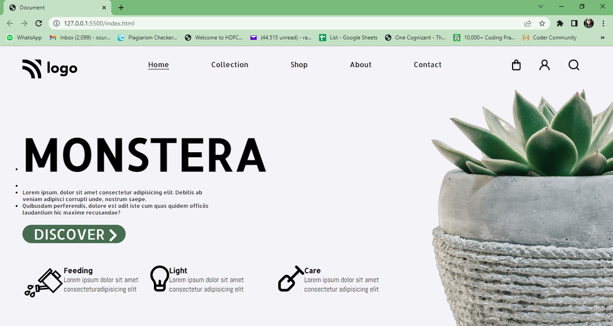

# Plant Home Page  

This is a simple web page design made using HTML and CSS only. Please check it out. 
***
### Name: SOURITA RAY
***
## Demo

## What have I learnt in this project?

In this project I have got hands on experience on
- CSS ID Selectors 
- Flexbox

> Note: It is better to make different CSS file rather writing CSS than in `<style>` tag in the head of the HTML document.

## Time required to complete the project

Approximately 2.5 to 3 hours.

## Contact me on:

- [Linked In-Sourita Ray](www.linkedin.com/in/sourita-ray-89bab0212)
- [Email-id Sourita Ray](souritaray@gmail.com)

## Feedback

You can provide your feedback at souritaray@gmail.com

